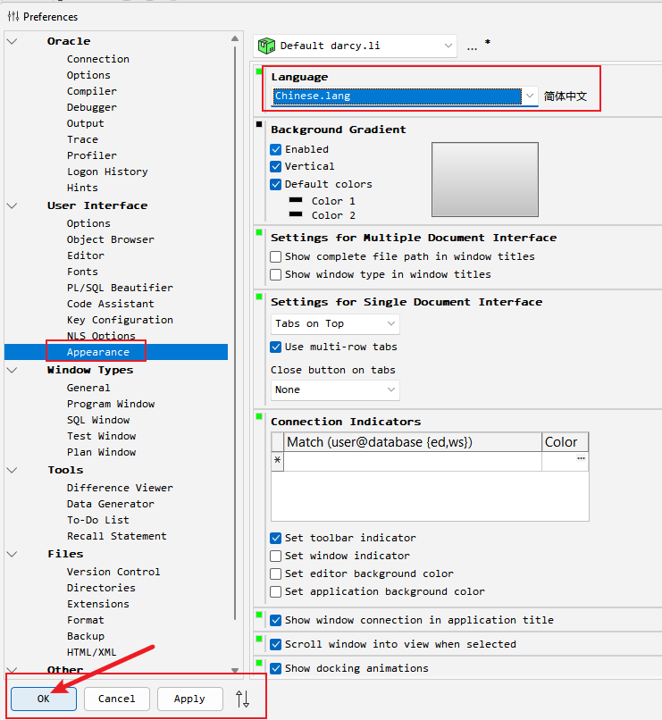

# 环境准备

在服务器端可以运行所有功能，但是编辑和排错非常曲折，所以我们推荐使用本地工具连接`ORACLE`数据库。

连接数据库，我们需要客户端与官方驱动：

##  驱动

> 官方驱动，选择对应版本驱动

驱动版本位数和客户端要保持一致，要么全都64位，要么全都32位。

[64位](https://www.oracle.com/database/technologies/instant-client/winx64-64-downloads.html)

[32位](https://www.oracle.com/database/technologies/instant-client/microsoft-windows-32-downloads.html)


+ 位数：本次我们都选择64位

+ 版本：本次我们选择`12.2.0.1.0`版本

GP5.3 对应的数据版本为`11.2.0.3.0`，我们可以选择此版本以上的驱动，高版本可以兼容低版本。


+ 解压：将下载的压缩文件解压到一个文件夹中，后续要用到

本次我们解压位置是`D:\app\oracle\instantclient_12_1`


## 客户端

> 我们选择`PLSQL Developer`，还可以选择`NVICAT`、`Toad for Oracle`等

+ 下载地址：[Download](https://www.allroundautomations.com/try-it-free/)


+ 输入注册码：第一次打开不要登陆，会提示输入注册码，如果没有提示，通过这里打开


+ 设置语言：设置语言为中文




+ 设置驱动位置：设置之前解压的驱动文件夹位置


+ 登陆：点击此按钮，或者重新打开软件，即可登陆


+ 测试：新增SQL文件，输入内容，点击执行按钮，如果一下内容说明连接成功


## SQL*Plus 客户端

> SQL*Plus 客户端，是`ORACLE`官方提供的命令行客户端，可以使用命令行连接数据库

> 在运维时，我们偶尔需要连接`SQL*Plus`客户端，所以要知道如何简单使用

在数据库服务器和EPR服务器都安装好了`SQL*Plus`客户端，所以可以直接使用。

+ 连接命令
```shell
    sqlplus [username]/[password]@[host]:[port]/[sid]
    sqlplus system/password@topprod
    sqlplus / as sysdba
```

+ 退出命令

```shell
    quit
```

> SQL*Plus中运行的SQL语句需要提交（`commit;`）并以`;`作为结束。