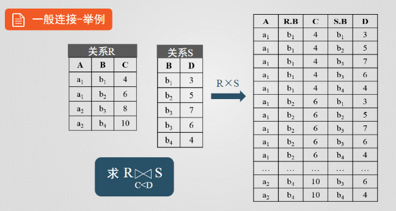

# 多表查询

资料准备

```sql
-- table1 :
create table user1(id number(3), user_name varchar(10), over varchar(10));
insert into user1 values(1, 'tangseng', 'dtgdf');
insert into user1 values(2, 'sunwukong', 'dzsf');
insert into user1 values(1, 'zhubajie', 'jtsz');
insert into user1 values(1, 'shaseng', 'jslh');
-- table2 :
create table user2(id number(3), user_name varchar(10), over varchar(10));
insert into user2 values(1, 'sunwukong', 'chengfo');
insert into user2 values(2, 'niumowang', 'chengyao');
insert into user2 values(3, 'jiaomowang', 'chengyao');
insert into user2 values(4, 'pengmowang', 'chengyao');
```

## ~~INNER 内连接~~


```sql
select a.id, a.user_name, b.over
from user1 a
inner join user2 b
on a.user_name=b.user_name;
```

    ID USER_NAME  OVER
    ---- ---------- ----------
    2 sunwukong  chengfo

## LEFT/RIGHT

### LEFT


> `left join`是`left outer join`的缩写，`outer 可以不写`

```sql
select a.id, a.user_name, b.over
from user1 a
left outer join user2 b
on a.user_name=b.user_name;
```

    ID USER_NAME  OVER
    ---- ---------- ----------
    2 sunwukong  chengfo
    1 shaseng
    1 zhubajie
    1 tangseng

### ~~RIGHT~~


> `left join`和`right join`区别就是量表的顺序不同，所以 `a left join b`和`b right join a` 是完全等效的，所以`right join`不必学习，使用时仅使用`left join`即可

```sql
select b.user_name, b.over, a.over
from user1 a
right join user2 b
on a.user_name=b.user_name;
```

    USER_NAME  OVER       OVER
    ---------- ---------- ----------
    sunwukong  chengfo    dzsf
    niumowang  chengyao
    jiaomowang chengyao
    pengmowang chengyao

## ~~FULL~~


```sql

select a.id, a.user_name, b.over
from user1 a
full join user2 b
on a.user_name=b.user_name
```

    ID USER_NAME  OVER
    ---- ---------- ----------
    2 sunwukong  chengfo
                    chengyao
                    chengyao
                    chengyao
    1 shaseng
    1 zhubajie
    1 tangseng

## 笛卡尔连接(交叉连接)



> `a,b`是`a cross b`的缩写，通常情况下，我们会进一步使用 where 条件筛选资料

```sql
select a.id,a.user_name,b.id,b.user_name
from user1 a,user2 b;
```

    ID USER_NAME    ID USER_NAME
    ---- ---------- ---- ----------
    1 tangseng      1 sunwukong
    1 tangseng      2 niumowang
    1 tangseng      3 jiaomowang
    1 tangseng      4 pengmowang
    2 sunwukong     1 sunwukong
    2 sunwukong     2 niumowang
    2 sunwukong     3 jiaomowang
    2 sunwukong     4 pengmowang
    1 zhubajie      1 sunwukong
    1 zhubajie      2 niumowang
    1 zhubajie      3 jiaomowang
    1 zhubajie      4 pengmowang
    1 shaseng       1 sunwukong
    1 shaseng       2 niumowang
    1 shaseng       3 jiaomowang
    1 shaseng       4 pengmowang

```sql
select a.id, a.user_name, b.over
from user1 a,user2 b
where a.user_name=b.user_name;
```

> 以上笛卡尔连接，配合`where`条件等效以下内连接，所以内连接也不需要学。

```sql
select a.id, a.user_name, b.over
from user1 a
inner join user2 b
on a.user_name=b.user_name;
```

    ID USER_NAME  OVER
    ---- ---------- ----------
    2 sunwukong  chengfo


## 总结

综上所述，我们只要笛卡尔连接，和`LEFT`左连接就可以解锁99%的场景，剩下1%场景，我们可以使用代码协助。

+ 笛卡尔连接，两个表都存在数据，才会显示出来

+ LEFT 连接，只要左表存在数据，右表数据为NULL也会显示出来